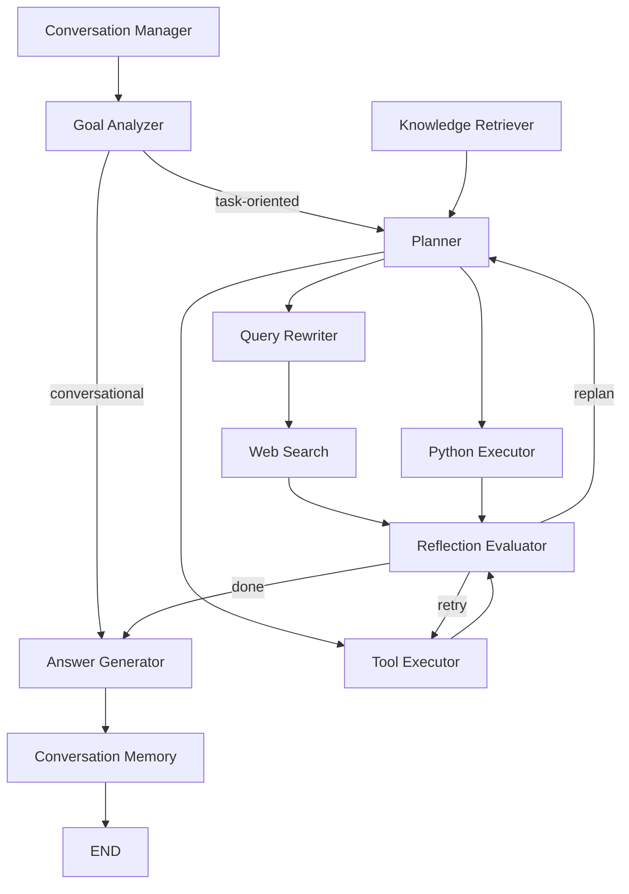

# OmniForge

OmniForge is a modular AI agent workspace built with Python, FastAPI, and LangGraph. It orchestrates specialized agents — planning, search, knowledge retrieval, code execution, reflection, and memory — through a dynamic task-queue workflow. OmniForge is the successor to AgentFlow, redesigned with a developer-first AI workspace experience.

## System Overview

OmniForge receives a user query, understands intent via a **hybrid embedding + LLM goal analyzer**, plans executable tasks, dispatches them to the right agent (knowledge, search, code, or tools), evaluates results, and synthesizes a final answer — all tracked through conversational memory.


## Agent Workflow




## Agent Matrix

| Agent | Role | Decision Mode |
|---|---|---|
| **Goal Analyzer** | Hybrid intent classification (embedding + LLM fallback), 6 goal types | Embedding-first, LLM fallback |
| **Planner** | Dynamic task queue generation (3–5 tasks/cycle), blueprint & template support | Blueprint → Template → Function-call → JSON |
| **Knowledge Retriever** | Hybrid RAG: vector (Qdrant) + lexical (SQLite FTS5) with RRF fusion | Parallel retrieval + score fusion |
| **Web Search** | Real-time search via DuckDuckGo / Tavily | Pluggable provider |
| **Python Executor** | Sandboxed subprocess code execution | Configurable safety |
| **Tool Executor** | Central dispatch for filesystem, git, database, browser, DOCX, MCP tools | Plugin registry auto-discovery |
| **Reflection Evaluator** | Task result evaluation and routing decision | Rule-first, LLM fallback |
| **Answer Generator** | Synthesizes final answer from all agent outputs | Context-aware prompt adaptation |
| **Conversation Manager** | Session state, slot filling, anaphora resolution, rewrite | Rule-based pipeline |
| **Conversation Memory** | Cross-turn history and entity tracking | Lightweight state tracking |

## Knowledge RAG Pipeline

The retrieval-augmented generation system supports PDF, DOCX, TXT, MD, HTML, XLSX, PPTX, CSV, EPUB, and source code files with structure-aware chunking.

```
Document → Parser → Chunker → Qwen Embedder (1024-d)
                                   ├── Qdrant (COSINE vector index)
                                   └── SQLite FTS5 (lexical index)
                                         ↓
                              Hybrid Retriever (RRF fusion)
                                   ↓
                              Top-K Results + Scores
```


- **Parser**: Multi-format document reader (pypdf, python-docx, openpyxl, python-pptx, BeautifulSoup, ebooklib)
- **Chunker**: Structure-aware strategies — paragraph, markdown (heading-preserving), code (function boundaries), table, slide
- **Embedder**: Qwen text-embedding-v3 via DashScope (1024-dimensional)
- **Retrieval**: Reciprocal Rank Fusion (RRF) combining vector (α=0.7) and lexical (β=0.3) scores; jieba CJK segmentation
- **Evaluation**: Built-in eval framework with recall@k, precision@k, ndcg@k, hit@k, MRR metrics

## Tool System

All tools follow a plugin architecture — extend `BaseTool`, register in the auto-discovery path, and the system picks up actions, schemas, and routing automatically.

| Tool | Capabilities |
|---|---|
| **FileSystem** | mkdir, write_file, read_file, edit_file, delete_file, list_files |
| **Search** | web.search via DuckDuckGo / Tavily |
| **Python** | Sandboxed subprocess execution |
| **Git** | status, diff, add, commit, branch, log |
| **Database** | SQL query execution |
| **Browser** | Browser automation |
| **DOCX** | Create formatted Word reports |
| **MCP** | MCP protocol integration |
| **Composio** | 500+ app integrations via Composio API |

## Project Structure

```
agentflow/
  agents/          Agent implementations (9 agents + base protocol)
  api/             FastAPI route handlers
  app/             Application entry point (FastAPI app, CORS, startup tasks)
  blueprints/      YAML-based project scaffolding (Jinja2 templates)
  config/          Pydantic settings (.env) and prompt templates
  conversation/    Session state, context rewrite, conversation manager
  database/        SQLite persistence (sessions, chats, documents, FTS5)
  knowledge/       RAG pipeline (parser, chunker, embedder, index, retriever, eval)
  models/          Pydantic models (chat, model_config)
  services/        LLM service, search, memory, file proposer
  tools/           Plugin tool implementations (10 tools)
  graph/           LangGraph workflow (nodes, edges, executor, context)
  utils/           Logging, decorators
frontend/          Vue 3 + TypeScript + Vite SPA (TailwindCSS, markdown-it)
tests/             Pytest suite (13+ test files)
```

## API Endpoints

| Category | Endpoints |
|---|---|
| **Chat** | `POST /chat`, `POST /chat/stream` (SSE) |
| **Knowledge** | `POST /upload`, `GET/DELETE /knowledge/documents`, `POST /knowledge/search` |
| **Sessions** | `POST /sessions/create`, `GET/PUT/DELETE /sessions/{id}`, `GET /history` |
| **Files** | `POST /files/create`, `POST /files/read`, `GET /files` |
| **Models** | `GET/POST/PUT/DELETE /models`, `POST /models/{id}/activate` |
| **Agents** | `GET /agents` |
| **Tools** | `GET /tools`, `GET /tools/capabilities`, `GET /tools/executor` |
| **Memory** | `GET/DELETE /memory`, `GET /memory/search` |
| **Workspace** | `GET/POST /workspace`, `POST /workspace/create-folder`, `GET /workspace/browse` |

## Quickstart

```bash
# 1. Clone and configure
git clone <repo-url> && cd multi_agent
cp .env.example .env   # fill in DEEPSEEK_API_KEY and DASHSCOPE_API_KEY

# 2. Install and run
uv sync
uv run uvicorn agentflow.app.main:app --reload --host 0.0.0.0 --port 8000

# 3. Open frontend
cd frontend && npm install && npm run dev
```

## Docker Deployment

```bash
docker compose -f agentflow/docker/docker-compose.yml up --build
```

## Development

```bash
python -m pytest -q                         # full suite
python -m pytest tests/test_workflow.py -q  # single file
```

## Screenshots

Replace the placeholder images in `screenshots/` with your own captures.

| Screenshot | File |
|---|---|
| Main Chat Interface | [screenshots/chat-interface.png](screenshots/chat-interface.png) |
| Agent Workflow Execution | [screenshots/workflow-execution.png](screenshots/workflow-execution.png) |
| Knowledge Base Management | [screenshots/knowledge-base.png](screenshots/knowledge-base.png) |
| Session & History Management | [screenshots/session-management.png](screenshots/session-management.png) |
| Model Configuration | [screenshots/model-settings.png](screenshots/model-settings.png) |
