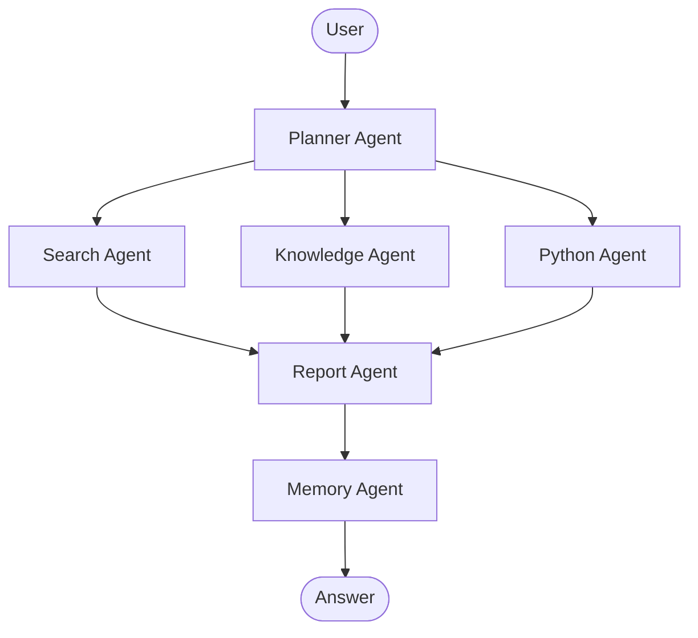

# AgentFlow

AgentFlow is a modular AI agent platform built with Python, FastAPI, LangGraph, and a collection of specialized agents for planning, search, knowledge retrieval, Python execution, reporting, and memory.

## Why AgentFlow

AgentFlow is designed as a practical, extensible foundation for building multi-agent AI applications. It separates concerns into independent agents, uses a real LangGraph stateful workflow, and keeps configuration, prompts, tools, and persistence modular.

## System Architecture



## Agent Overview

- Planner Agent: analyzes the request and builds a workflow plan.
- Search Agent: gathers external information through a pluggable search tool abstraction.
- Knowledge Agent: prepares local retrieval from markdown, text, and document-like sources.
- Python Agent: prepares Python-based analysis and visualization workflows.
- Report Agent: synthesizes results into a concise answer and report.
- Memory Agent: stores lightweight session memory.

## Project Structure

- agentflow/app: FastAPI entry points
- agentflow/api: route handlers
- agentflow/agents: agent implementations
- agentflow/graph: LangGraph workflow composition
- agentflow/tools: reusable tools
- agentflow/prompts: prompt templates
- agentflow/config: centralized settings
- agentflow/database: persistence layer
- agentflow/docs: documentation
- tests: automated verification

## Quickstart

1. Clone the repository.
2. Copy .env.example to .env and configure your DeepSeek settings.
3. Install dependencies with uv.
4. Run the API server.

```bash
uv sync
uv run uvicorn agentflow.app.main:app --reload --host 0.0.0.0 --port 8000
```

## Docker Deployment

```bash
docker compose -f agentflow/docker/docker-compose.yml up --build
```

## API

- POST /chat
- POST /upload
- GET /history
- GET /health

## Development

```bash
python -m pytest -q
```

## Roadmap

- Add search providers such as Tavily, Firecrawl, and Google Search
- Add richer document ingestion for PDF and Word files
- Add Redis-backed session and memory scaling
- Add a web UI and richer report rendering
- Add safety controls and sandboxed Python execution

## Screenshots

Placeholder for screenshots and demo GIFs.
