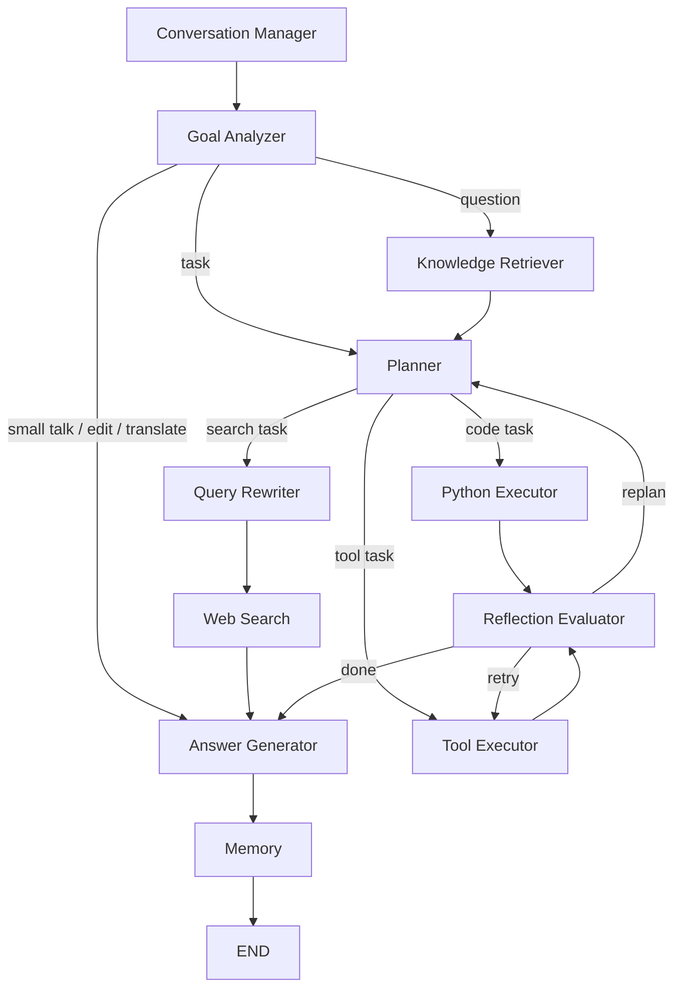

# OmniForge

**A modular multi-agent AI workspace — one request in, a tracked plan / execute / reflect / answer loop out.**


OmniForge turns a single natural-language goal into an executed workflow: intent
classification → knowledge retrieval → task planning → tool / code execution →
reflection → answer → memory. Every stage is a node in a LangGraph state machine,
and nothing about agents, tools, routing or planner allowlists is hard-coded —
they are discovered from a plugin registry at runtime.

**中文速览**：OmniForge 是一个目标驱动的多智能体 AI 工作台。用户给一句话目标，系统
识别意图 → 规划任务 → 调度工具与代码 → 反思结果 → 生成回答，全程维护会话记忆与知识库。
技术栈为 FastAPI + LangGraph + Vue 3，Agent 与工具均插件化注册；内置 5 套离线评测
（332 条样本）与 538 项自动化测试，CI 在 Windows / Ubuntu 双系统执行。文档体系覆盖
项目章程、路线图、架构、部署、运维手册、风险登记册与 4 份架构决策记录（ADR）。

## Table of Contents

- [Highlights](#highlights)
- [How It Works](#how-it-works)
- [Agent Matrix](#agent-matrix)
- [Knowledge & RAG Pipeline](#knowledge--rag-pipeline)
- [Tool System](#tool-system)
- [Design Decisions](#design-decisions)
- [Project Structure](#project-structure)
- [API Endpoints](#api-endpoints)
- [Quickstart](#quickstart)
- [Configuration](#configuration)
- [Deployment](#deployment)
- [Evaluation & Quality](#evaluation--quality)
- [Testing](#testing)
- [Runtime Feedback Loop](#runtime-feedback-loop)
- [Screenshots](#screenshots)
- [Documentation](#documentation)
- [Roadmap & Status](#roadmap--status)
- [License](#license)

## Highlights

- **11-node agent workflow, 9 registered agents.** Conditional edges skip work that
  is not needed — a small-talk request never reaches the planner, and a successful
  task does not pay for a reflection LLM call.
- **Self-describing plugin tools.** Extend `BaseTool`, drop the file in
  `agentflow/tools/`, and the registry auto-discovers actions, generates OpenAI
  function schemas, and wires the tool into workflow routing. No central switch
  statement to edit.
- **Intent fast path.** A hybrid embedding + anchor index classifies common goals
  before falling back to an LLM, cutting 2–3 model calls per session on typical traffic.
- **Hybrid RAG with two independent indexes.** Qdrant vector search (cosine) fused with
  SQLite FTS5 lexical search via Reciprocal Rank Fusion, so retrieval survives an
  embedding-provider outage instead of failing the request.
- **Graceful degradation everywhere.** A 5-level fallback plus bounded replan / stuck
  rounds: a missing API key, a dead embedding endpoint or a failing tool degrades the
  run and says so in the answer, rather than hanging the task.
- **Bounded parallelism.** Task queues execute in batches (up to 8 concurrent tasks)
  with loop-termination guards and per-node tracing.
- **Built-in evaluation loop.** 5 offline suites (332 samples) plus runtime feedback
  capture, so tuning is argued from measured cases rather than hand-written fixtures.
- **Production-shaped delivery.** Docker Compose (API + nginx), HTTPS, Kubernetes
  manifests with persistent volumes and ingress, JSON logs with `trace_id`,
  `/health` and `/metrics`.

## How It Works


```mermaid
flowchart TD
    CM[Conversation Manager] --> GA[Goal Analyzer]
    GA -- small talk / edit / translate --> AG[Answer Generator]
    GA -- question --> KB[Knowledge Retriever]
    GA -- task --> PL[Planner]
    KB --> PL
    PL -- search task --> QR[Query Rewriter] --> SE[Web Search] --> AG
    PL -- code task --> PY[Python Executor]
    PL -- tool task --> TE[Tool Executor]
    PY --> RF[Reflection Evaluator]
    TE --> RF
    RF -- replan --> PL
    RF -- retry --> TE
    RF -- done --> AG
    AG --> MM[Memory] --> END
```

Three properties make the loop safe to leave running:

- **Reflection is conditional.** Successful tasks continue without an extra LLM call;
  reflection fires on failure, empty queues, or periodic checkpoints.
- **Termination is bounded.** Planner cycles, replans and stuck rounds each have a cap
  (`agentflow/config/termination.py`); exceeding one forces the run to wrap up.
- **Degradation is visible.** Nodes report failures into a shared error channel, and the
  final answer states when it was produced in a restricted mode.


## Agent Matrix

| Agent | Role | Decision Mode |
|---|---|---|
| **Goal Analyzer** | Hybrid intent classification (embedding + LLM fallback), 6 goal types | Embedding-first, LLM fallback |
| **Planner** | Dynamic task queue generation (3–5 tasks/cycle), blueprint & template support | Blueprint → Template → Function-call → JSON |
| **Knowledge Retriever** | Hybrid RAG: vector (Qdrant) + lexical (SQLite FTS5) with RRF fusion | Parallel retrieval + score fusion |
| **Web Search** | Real-time search via DuckDuckGo / Tavily | Pluggable provider |
| **Python Executor** | Sandboxed subprocess code execution | Configurable safety |
| **Tool Executor** | Central dispatch for filesystem, git, search, python, DOCX, Composio tools | Plugin registry auto-discovery |
| **Reflection Evaluator** | Task result evaluation and routing decision | Rule-first, LLM fallback |
| **Answer Generator** | Synthesizes final answer from all agent outputs | Context-aware prompt adaptation |
| **Conversation Memory** | Cross-turn history, rolling summary, entity tracking | Lightweight state tracking |

`Conversation Manager` (session state, slot filling, anaphora resolution, query
rewrite) is a workflow node rather than a registered agent — it runs before intent
analysis and rewrites follow-up questions into standalone ones.

## Knowledge & RAG Pipeline

The knowledge base ingests PDF, DOCX, TXT, MD, HTML, XLSX, PPTX, CSV, EPUB and source
code files with structure-aware chunking.

```
Document → Parser → Chunker → Qwen Embedder (v2/v3)
                                   ├── Qdrant (COSINE vector index)
                                   └── SQLite FTS5 (lexical index)
                                         ↓
                              Hybrid Retriever (RRF fusion)
                                   ↓
                              Top-K Results + Scores
```

| Stage | Implementation |
|---|---|
| **Parser** | Multi-format reader (pypdf, python-docx, openpyxl, python-pptx, BeautifulSoup, ebooklib) |
| **Chunker** | Structure-aware strategies — paragraph, markdown (heading-preserving), code (function boundaries), table, slide |
| **Embedder** | Qwen `text-embedding-v2/v3` via DashScope (1024/1536-d, dimension auto-detected) with a local embedding cache |
| **Retrieval** | Reciprocal Rank Fusion combining vector (α=0.7) and lexical (β=0.3) scores; jieba CJK segmentation |
| **Fallback** | Qdrant or embedding API unavailable → automatic lexical-only retrieval |
| **Evaluation** | `recall@k`, `precision@k`, `ndcg@k`, `hit@k`, `MRR` over 150 RAG samples |


## Tool System

Tools are plugins. Extend `BaseTool`, declare `actions()`, and the registry takes care
of discovery, schema generation, capability descriptions and workflow routing.

| Tool | Capabilities |
|---|---|
| **FileSystem** | mkdir, create/write/append/read/edit/replace, delete, move, copy, rename, exists, list, tree (workspace-confined) |
| **Search** | `web.search` via DuckDuckGo / Tavily |
| **Python** | Sandboxed subprocess execution with import blocking and syntax validation |
| **Git** | status, diff, add, commit, checkout, branch, log, show |
| **DOCX** | Create/read tables, replace text, add comments, validate, convert to PDF (needs LibreOffice) |
| **Composio** | 500+ app integrations through the Composio API |

Planned integrations (browser automation, MCP, SQL databases) are tracked in
[docs/product/backlog.md](docs/product/backlog.md). The repo ships no non-functional
tool placeholders — every registered tool has working actions.

## Design Decisions

Architecture Decision Records explain why the system looks the way it does:

| ADR | Decision |
|---|---|
| [ADR-0001](docs/decisions/ADR-0001-langgraph-state-graph.md) | Use a LangGraph `StateGraph` to orchestrate the multi-agent workflow |
| [ADR-0002](docs/decisions/ADR-0002-sqlite-and-local-qdrant.md) | Single-instance storage: SQLite + on-disk Qdrant |
| [ADR-0003](docs/decisions/ADR-0003-pluginnable-tool-registry.md) | The plugin tool registry is the single source of tool metadata |
| [ADR-0004](docs/decisions/ADR-0004-graceful-degradation.md) | Unified degradation strategy (circuit breaker + rule fallback + termination caps) |

## Project Structure

```
agentflow/
  agents/          Agent implementations (9 agents + base protocol)
  api/             FastAPI route handlers (split by domain: chat, knowledge,
                   sessions, files/workspace, models, memory, executions, system)
  app/             Application entry point (FastAPI app, CORS, startup tasks)
  blueprints/      YAML-based project scaffolding (Jinja2 templates)
  config/          Pydantic settings (.env), prompt templates, termination policy
  conversation/    Session state, context rewrite, conversation manager,
                   layered-memory compression
  database/        SQLite persistence (sessions, chats, documents, FTS5)
  eval/            Offline eval suites + runtime feedback collection (eval loop)
  knowledge/       RAG pipeline (parser, chunker, embedder, index, retriever, eval)
  models/          Pydantic models (chat, model_config)
  services/        LLM service, search, memory, file proposer
  tools/           Plugin tool implementations (6 tools)
  graph/           LangGraph workflow (nodes, edges, executor, context)
  utils/           Logging, decorators
frontend/          Vue 3 + TypeScript + Vite SPA (TailwindCSS, markdown-it)
deploy/            Production deployment: nginx (frontend + HTTPS), k8s manifests
scripts/           Utility scripts (backend/frontend launchers, feedback export)
tests/             Pytest suite (48 files, 538 tests, per-module coverage)
screenshots/       UI captures used by this README
data/feedback/     Runtime feedback records for the eval loop (gitignored)
```

## API Endpoints

42 HTTP operations across 8 route modules (40 router endpoints plus `/health` and
`/metrics` on the app itself).

| Category | Endpoints |
|---|---|
| **Chat** | `POST /chat`, `POST /chat/stream` (SSE) |
| **Executions** | `GET /executions`, `GET /executions/{id}`, `GET /executions/{id}/trace`, `GET /executions/{id}/checkpoints`, `POST /executions/{id}/resume` |
| **Knowledge** | `POST /upload`, `POST /knowledge/search`, `POST /knowledge/rebuild`, `GET /knowledge/documents`, `GET /knowledge/documents/{id}/read`, `DELETE /knowledge/documents/{id}` |
| **Sessions** | `POST /sessions/create`, `GET /sessions`, `GET /sessions/{id}/messages`, `PUT /sessions/{id}/rename`, `DELETE /sessions/{id}`, `POST /sessions/cleanup`, `GET /history` |
| **Files & Workspace** | `POST /files/create`, `POST /files/read`, `GET /files`, `GET /workspace`, `POST /workspace/set`, `POST /workspace/create-folder`, `GET /workspace/browse` |
| **Models** | `GET /models`, `POST /models`, `PUT /models/{id}`, `DELETE /models/{id}`, `POST /models/{id}/activate` |
| **Memory** | `GET /memory`, `GET /memory/search`, `DELETE /memory/{key}`, `DELETE /memory` |
| **System** | `GET /agents`, `GET /tools`, `GET /tools/capabilities`, `GET /tools/executor` |
| **Ops** | `GET /health` (component-level status), `GET /metrics` (Prometheus text format) |

## Quickstart

### Prerequisites

- **Python 3.12+** (CI runs 3.12 on Ubuntu and Windows)
- **Node.js 20+** and npm — only for the frontend
- **uv** (recommended) or plain `pip`
- **Docker + Docker Compose** — only for containerised deployment
- **LibreOffice** (`soffice` on `PATH`) — only for the DOCX → PDF conversion action

### 1. Configure

```bash
git clone https://github.com/syp0988-dotcom/OmniForge.git
cd OmniForge
cp .env.example .env      # Windows: copy .env.example .env
```

Set at least `DEEPSEEK_API_KEY` in `.env`. Every other key is optional — the system
starts without it and logs exactly which capability was degraded (see
[Configuration](#configuration)).

### 2. Run the backend

```bash
uv sync                                             # or: pip install -r requirements.txt
uv run uvicorn agentflow.app.main:app --reload --host 0.0.0.0 --port 8000
# convenience wrapper: python scripts/run_backend.py
```

### 3. Run the frontend

```bash
cd frontend
npm install
npm run dev            # Vite dev server
```

### 4. Verify the install

```bash
curl http://localhost:8000/health     # component-level status
```

`/health` reports database, knowledge index and LLM configuration status, so a
half-configured environment is obvious immediately. Open the frontend, ask a question
that needs the knowledge base, then check `GET /executions/{id}/trace` to see the
node-by-node run.

## Configuration

The system degrades gracefully when optional API keys are missing — startup logs list
exactly which capabilities are affected.

| Env var | Enables | When missing |
|---|---|---|
| `DEEPSEEK_API_KEY` | Core LLM | Everything degrades |
| `EMBEDDING_API_KEY` | RAG vector search, intent fast path, embedding cache | Lexical-only retrieval + LLM intent |
| `TAVILY_API_KEY` | Structured web search | DuckDuckGo fallback |
| `COMPOSIO_API_KEY` | 500+ app integrations | Tool reports "not configured" |
| `QDRANT_URL` | Remote/cloud Qdrant instead of the on-disk index | Local `data/qdrant` is used |
| `APP_ENV=production` / `ENFORCE_REQUIRED_ENV=true` | Fail fast at startup when required keys are missing | Silent degradation is allowed |

Agent loop guards are tunable via `MAX_PLANNER_CYCLES`, `MAX_REPLAN_COUNT`,
`MAX_STUCK_ROUNDS`, `REFLECTOR_PLANNER_CYCLE_CAP`; per-node token budgets via
`PLANNER_MAX_TOKENS`, `CODEGEN_MAX_TOKENS`, `ANSWER_MAX_TOKENS`,
`GOAL_ANALYZER_MAX_TOKENS`; layered memory via `ENABLE_HISTORY_COMPRESSION`,
`HISTORY_TOKEN_BUDGET`, `HISTORY_MIN_KEEP_MESSAGES`.
See [.env.example](.env.example) for the full annotated list.

## Deployment

### Docker Compose

```bash
docker compose up --build -d
```

The root [`docker-compose.yml`](docker-compose.yml) runs two services:

- **app** — the API (root [`Dockerfile`](Dockerfile), non-root user, healthcheck).
  Persistent volumes keep the SQLite database, local Qdrant index, embedding cache,
  uploaded/knowledge documents and logs across container recreation.
- **web** — nginx serving the built Vue SPA and reverse-proxying the API
  (`/chat`, `/chat/stream` with SSE, `/knowledge`, ...). HTTPS on port 443 requires
  certificates in `deploy/nginx/certs/`
  (see [certs/README.md](deploy/nginx/certs/README.md)); for a no-certificate test
  build use `docker compose build --build-arg NGINX_CONF=nginx-http.conf web`.

### Kubernetes

`deploy/k8s/` holds the reference manifests: `configmap.yaml` (non-secret settings),
`deployment.yaml` + `service.yaml` (API), `pvc.yaml` with volume mounts (persistent
RAG/database data), `ingress.yaml` (TLS termination), and the `agentflow-web` nginx
deployment/service for the frontend.

### Production notes

- Set `APP_ENV=production`: startup then fails fast when `DEEPSEEK_API_KEY` /
  `EMBEDDING_API_KEY` are missing instead of degrading quietly.
- Logs are JSON-formatted with `trace_id` and rotate daily
  (`LOG_ROTATION_WHEN`, `LOG_ROTATION_BACKUP_COUNT`).
- Upgrade, rollback, smoke-acceptance and backup/restore procedures live in
  [docs/deployment.md](docs/deployment.md) and [docs/runbook.md](docs/runbook.md).

## Evaluation & Quality

Quality claims here are meant to be reproducible, so the evaluation framework ships
with the code.

| Suite | Samples | What it measures |
|---|---|---|
| Tool Eval | 71 | Tool/action selection and argument correctness (mock mode, no API calls) |
| Intent Eval | 57 | `goal_type` classification accuracy across 6 intent classes |
| Planner Eval | 32 | Task decomposition: expected tools, actions, task-count ranges |
| Completion Eval | 22 | End-to-end goal completion and task progress |
| RAG Eval | 150 | Retrieval quality: recall@k, precision@k, ndcg@k, hit@k, MRR |
| **Total** | **332** | |

```bash
# Run every suite and print a summary (RAG eval needs an indexed knowledge base)
python agentflow/eval/run_all.py

# Export captured runtime failures for review
python scripts/export_feedback.py --out data/feedback/failure_cases.json
```

Evaluation outputs are written under `data/` and are not committed — a fresh clone
reproduces its own numbers instead of trusting a stored snapshot.

## Testing

538 tests across 48 files, one dedicated file per major module:

| Module | Test file |
|---|---|
| Planner / Reflection | `tests/test_planner_agent.py`, `tests/test_reflection_agent.py` |
| Answer / Memory agents | `tests/test_answer_agent.py`, `tests/test_memory_agent.py` |
| Conversation & compression | `tests/test_conversation_runtime.py`, `tests/test_history_compression.py` |
| RAG parser / chunker / retriever | `tests/test_parser_chunking.py`, `tests/test_knowledge_retrieval.py` |
| SQLite store | `tests/test_sqlite_store.py` |
| Tools (filesystem, git, docx, composio) | `tests/test_tool_framework.py`, `tests/test_git_tool.py`, `tests/test_docx_tool.py`, `tests/test_composio_tool.py` |
| Workflow routing / termination | `tests/test_workflow_routing.py`, `tests/test_termination_policy.py` |
| Eval framework / blueprints | `tests/test_eval_suite.py`, `tests/test_blueprints.py`, `tests/test_blueprints_integration.py` |
| Production readiness | `tests/test_production_readiness.py` |

```bash
uv run python -m pytest -q                          # full suite
uv run python -m pytest tests/test_workflow.py -q   # single file
uv run ruff check agentflow tests                   # lint
uv run python -m pytest -q --cov=agentflow --cov-report=term
```

CI (`.github/workflows/ci.yml`) runs three jobs on every push and pull request:

- **Backend tests** on an `ubuntu-latest` / `windows-latest` matrix with a coverage
  floor (`--cov-fail-under=50`), so regressions fail the build on both platforms.
- **Ruff lint** over `agentflow` and `tests`.
- **Frontend** `npm ci` + `vue-tsc` typecheck + production build on Node 20.

## Runtime Feedback Loop

Every chat turn is a potential evaluation example. The chat endpoints append structured
records (outcome, goal type, errors, question/answer) to
`data/feedback/feedback.jsonl` — failures always, successful project/coding completions
as well. Export and review them with:

```bash
python scripts/export_feedback.py --out data/feedback/failure_cases.json
```

Feed reviewed cases back into the offline eval datasets (`agentflow/eval/*`) so tuning
decisions are backed by real usage, not just hand-written fixtures.

## Screenshots

Captured from the running application (2560×1600).

| Agent Workflow Execution | Session & History |
|---|---|
|  |  |

| Knowledge Base | Model Configuration |
|---|---|
|  |  |

## Documentation

Project management and engineering documents — start here when onboarding or planning:

| Document | Purpose |
|---|---|
| [PROJECT_CHARTER.md](PROJECT_CHARTER.md) | 定位、目标、非目标、成功标准、待决策项 |
| [ROADMAP.md](ROADMAP.md) | 里程碑 M0–M3 与退出标准 |
| [docs/README.md](docs/README.md) | 文档总索引 |
| [docs/architecture.md](docs/architecture.md) | 架构、请求生命周期、数据存储、扩展点 |
| [docs/deployment.md](docs/deployment.md) | 部署、环境变量、升级回滚、发布验收 |
| [docs/runbook.md](docs/runbook.md) | 巡检、故障处置、备份恢复 |
| [docs/risk-register.md](docs/risk-register.md) | 风险登记册 |
| [docs/product/status.md](docs/product/status.md) | 承诺 vs 实现差异表 |
| [docs/product/backlog.md](docs/product/backlog.md) | 待办优先级与验收标准 |
| [docs/decisions/](docs/decisions/README.md) | 架构决策记录（ADR） |
| [docs/reviews/](docs/reviews) | 技术评审报告存档 |
| [CHANGELOG.md](CHANGELOG.md) / [CONTRIBUTING.md](CONTRIBUTING.md) | 变更日志与贡献指南 |

## Roadmap & Status

Delivery runs in four milestones — **安全与可信 → 可用与一致 → 稳定与可观测 → 体验与增长** —
each with explicit exit criteria rather than dates alone. See [ROADMAP.md](ROADMAP.md)
for the milestone table and exit standards, [docs/product/backlog.md](docs/product/backlog.md)
for the prioritised P0–P2 work, and [docs/product/status.md](docs/product/status.md) for
the promise-vs-implementation diff (including known gaps).

## License

This repository does not include a license file yet, so the default copyright applies.
Add one (MIT is the common choice for portfolio projects) before accepting external
contributions or reuse.
