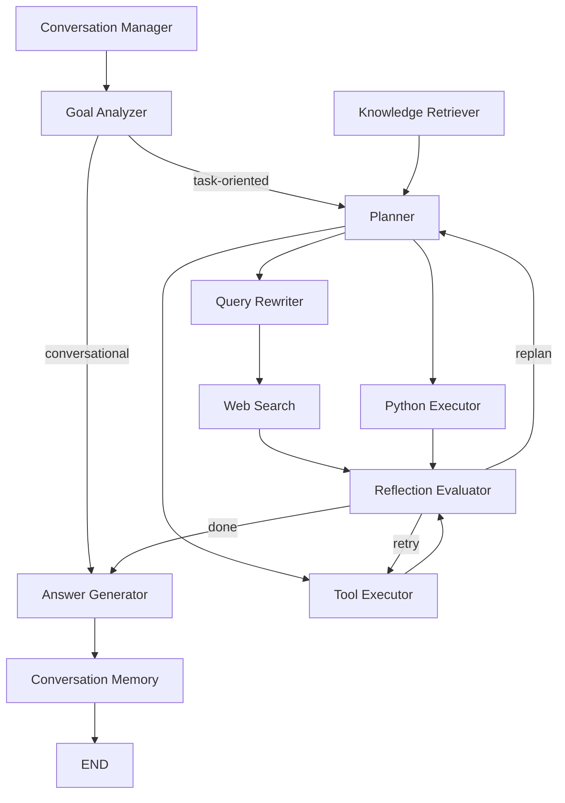

# OmniForge

OmniForge is a modular AI agent workspace built with Python, FastAPI, and LangGraph. It orchestrates specialized agents — planning, search, knowledge retrieval, code execution, reflection, and memory — through a dynamic task-queue workflow. OmniForge is the successor to AgentFlow, redesigned with a developer-first AI workspace experience.

## Project Docs

Project management and engineering documents — start here when onboarding or planning:

| Document | Purpose |
|---|---|
| [PROJECT_CHARTER.md](PROJECT_CHARTER.md) | 定位、目标、非目标、成功标准、待决策项 |
| [ROADMAP.md](ROADMAP.md) | 里程碑 M0–M3 与退出标准 |
| [docs/README.md](docs/README.md) | 文档总索引 |
| [docs/architecture.md](docs/architecture.md) | 架构、请求生命周期、数据存储、扩展点 |
| [docs/deployment.md](docs/deployment.md) | 部署、环境变量、升级回滚、发布验收 |
| [docs/runbook.md](docs/runbook.md) | 巡检、故障处置、备份恢复 |
| [docs/risk-register.md](docs/risk-register.md) | 风险登记册 |
| [docs/product/status.md](docs/product/status.md) | 承诺 vs 实现差异表 |
| [docs/product/backlog.md](docs/product/backlog.md) | 待办优先级与验收标准 |
| [docs/decisions/](docs/decisions/README.md) | 架构决策记录（ADR） |
| [docs/reviews/](docs/reviews) | 技术评审报告存档 |
| [CHANGELOG.md](CHANGELOG.md) / [CONTRIBUTING.md](CONTRIBUTING.md) | 变更日志与贡献指南 |

## System Overview

OmniForge receives a user query, understands intent via a **hybrid embedding + LLM goal analyzer**, plans executable tasks, dispatches them to the right agent (knowledge, search, code, or tools), evaluates results, and synthesizes a final answer — all tracked through conversational memory.


## Agent Workflow


```mermaid
flowchart TD
    CM[Conversation Manager] --> GA[Goal Analyzer]
    GA -- conversational --> AG[Answer Generator]
    GA -- task-oriented --> PL[Planner]
    KR[Knowledge Retriever] --> PL
    PL --> QW[Query Rewriter] --> SE[Web Search]
    PL --> PE[Python Executor]
    PL --> TE[Tool Executor]
    SE --> RF[Reflection Evaluator]
    PE --> RF
    TE --> RF
    RF -- replan --> PL
    RF -- retry --> TE
    RF -- done --> AG
    AG --> MM[Conversation Memory] --> END
```


## Agent Matrix

| Agent | Role | Decision Mode |
|---|---|---|
| **Goal Analyzer** | Hybrid intent classification (embedding + LLM fallback), 6 goal types | Embedding-first, LLM fallback |
| **Planner** | Dynamic task queue generation (3–5 tasks/cycle), blueprint & template support | Blueprint → Template → Function-call → JSON |
| **Knowledge Retriever** | Hybrid RAG: vector (Qdrant) + lexical (SQLite FTS5) with RRF fusion | Parallel retrieval + score fusion |
| **Web Search** | Real-time search via DuckDuckGo / Tavily | Pluggable provider |
| **Python Executor** | Sandboxed subprocess code execution | Configurable safety |
| **Tool Executor** | Central dispatch for filesystem, git, search, python, DOCX, Composio tools | Plugin registry auto-discovery |
| **Reflection Evaluator** | Task result evaluation and routing decision | Rule-first, LLM fallback |
| **Answer Generator** | Synthesizes final answer from all agent outputs | Context-aware prompt adaptation |
| **Conversation Manager** | Session state, slot filling, anaphora resolution, rewrite | Rule-based pipeline |
| **Conversation Memory** | Cross-turn history and entity tracking | Lightweight state tracking |

## Knowledge RAG Pipeline

The retrieval-augmented generation system supports PDF, DOCX, TXT, MD, HTML, XLSX, PPTX, CSV, EPUB, and source code files with structure-aware chunking.

```
Document → Parser → Chunker → Qwen Embedder (v2/v3)
                                   ├── Qdrant (COSINE vector index)
                                   └── SQLite FTS5 (lexical index)
                                         ↓
                              Hybrid Retriever (RRF fusion)
                                   ↓
                              Top-K Results + Scores
```


- **Parser**: Multi-format document reader (pypdf, python-docx, openpyxl, python-pptx, BeautifulSoup, ebooklib)
- **Chunker**: Structure-aware strategies — paragraph, markdown (heading-preserving), code (function boundaries), table, slide
- **Embedder**: Qwen text-embedding-v2/v3 via DashScope (1024/1536-d, dimension auto-detected)
- **Retrieval**: Reciprocal Rank Fusion (RRF) combining vector (α=0.7) and lexical (β=0.3) scores; jieba CJK segmentation
- **Evaluation**: Built-in eval framework with recall@k, precision@k, ndcg@k, hit@k, MRR metrics

## Tool System

All tools follow a plugin architecture — extend `BaseTool`, register in the auto-discovery path, and the system picks up actions, schemas, and routing automatically.

| Tool | Capabilities |
|---|---|
| **FileSystem** | mkdir, write_file, read_file, edit_file, delete_file, list_files |
| **Search** | web.search via DuckDuckGo / Tavily |
| **Python** | Sandboxed subprocess execution |
| **Git** | status, diff, add, commit, branch, log |
| **DOCX** | Create formatted Word reports |
| **Composio** | 500+ app integrations via Composio API |

Planned integrations (browser automation, MCP, SQL databases) are tracked in
[docs/product/backlog.md](docs/product/backlog.md); the repo ships no
non-functional tool placeholders.

## Project Structure

```
agentflow/
  agents/          Agent implementations (9 agents + base protocol)
  api/             FastAPI route handlers (split by domain: chat, knowledge,
                   sessions, files/workspace, models, memory, executions, system)
  app/             Application entry point (FastAPI app, CORS, startup tasks)
  blueprints/      YAML-based project scaffolding (Jinja2 templates)
  config/          Pydantic settings (.env), prompt templates, termination policy
  conversation/    Session state, context rewrite, conversation manager,
                   layered-memory compression
  database/        SQLite persistence (sessions, chats, documents, FTS5)
  eval/            Offline eval suites + runtime feedback collection (eval loop)
  knowledge/       RAG pipeline (parser, chunker, embedder, index, retriever, eval)
  models/          Pydantic models (chat, model_config)
  services/        LLM service, search, memory, file proposer
  tools/           Plugin tool implementations (6 tools)
  graph/           LangGraph workflow (nodes, edges, executor, context)
  utils/           Logging, decorators
frontend/          Vue 3 + TypeScript + Vite SPA (TailwindCSS, markdown-it)
deploy/            Production deployment: nginx (frontend + HTTPS), k8s manifests
scripts/           Utility scripts (backend/frontend launchers, feedback export)
tests/             Pytest suite (25+ files, per-module dedicated tests)
data/feedback/     Runtime feedback records for the eval loop (gitignored)
```

## API Endpoints

| Category | Endpoints |
|---|---|
| **Chat** | `POST /chat`, `POST /chat/stream` (SSE) |
| **Knowledge** | `POST /upload`, `GET/DELETE /knowledge/documents`, `POST /knowledge/search` |
| **Sessions** | `POST /sessions/create`, `GET/PUT/DELETE /sessions/{id}`, `GET /history` |
| **Files** | `POST /files/create`, `POST /files/read`, `GET /files` |
| **Models** | `GET/POST/PUT/DELETE /models`, `POST /models/{id}/activate` |
| **Agents** | `GET /agents` |
| **Tools** | `GET /tools`, `GET /tools/capabilities`, `GET /tools/executor` |
| **Memory** | `GET/DELETE /memory`, `GET /memory/search` |
| **Workspace** | `GET/POST /workspace`, `POST /workspace/create-folder`, `GET /workspace/browse` |

## Quickstart

```bash
# 1. Clone and configure
git clone <repo-url> && cd multi_agent
cp .env.example .env   # fill in DEEPSEEK_API_KEY and DASHSCOPE_API_KEY

# 2. Install and run
uv sync
uv run uvicorn agentflow.app.main:app --reload --host 0.0.0.0 --port 8000

# 3. Open frontend
cd frontend && npm install && npm run dev
```

## Docker Deployment

```bash
docker compose up --build -d
```

The root [`docker-compose.yml`](docker-compose.yml) runs two services:

- **app** — the API (root [`Dockerfile`](Dockerfile), non-root user,
  healthcheck). Persistent volumes keep the SQLite database, local Qdrant
  index, embedding cache, uploaded/knowledge documents and logs across
  container recreation.
- **web** — nginx serving the built Vue SPA and reverse-proxying the API
  (`/chat`, `/chat/stream` with SSE, `/knowledge`, ...). HTTPS on port 443
  requires certificates in `deploy/nginx/certs/`
  (see [certs/README.md](deploy/nginx/certs/README.md)); for a no-certificate
  test build use `docker compose build --build-arg NGINX_CONF=nginx-http.conf web`.

The `deploy/k8s/` manifests are the Kubernetes reference:
`configmap.yaml` (non-secret settings), `pvc.yaml` + volume mounts (persistent
RAG/database data), `ingress.yaml` (TLS termination), and the `agentflow-web`
nginx deployment for the frontend.

### Production environment checks

- Set `APP_ENV=production` (or `ENFORCE_REQUIRED_ENV=true`): startup then fails
  fast when `DEEPSEEK_API_KEY` / `EMBEDDING_API_KEY` are missing.
- Logs are JSON-formatted with `trace_id` and rotate daily
  (`LOG_ROTATION_WHEN`, `LOG_ROTATION_BACKUP_COUNT`).
- If Qdrant or the embedding API is unavailable at runtime, knowledge
  retrieval automatically degrades to lexical (FTS5) search.

## Development

```bash
uv sync --dev                               # install runtime + dev dependencies (pytest, ruff)
uv run python -m pytest -q                  # full suite
uv run python -m pytest tests/test_workflow.py -q  # single file
uv run ruff check agentflow tests           # lint
```

## Testing

The suite (536 tests) covers every major module with a dedicated test file:

| Module | Test file |
|---|---|
| Planner / Reflection | `tests/test_planner_agent.py`, `tests/test_reflection_agent.py` |
| Answer / Memory agents | `tests/test_answer_agent.py`, `tests/test_memory_agent.py` |
| Conversation & compression | `tests/test_conversation_runtime.py`, `tests/test_history_compression.py` |
| RAG parser / chunker / retriever | `tests/test_parser_chunking.py`, `tests/test_knowledge_retrieval.py` |
| SQLite store | `tests/test_sqlite_store.py` |
| Tools (filesystem, git, docx, composio) | `tests/test_tool_framework.py`, `tests/test_git_tool.py`, `tests/test_docx_tool.py`, `tests/test_composio_tool.py` |
| Workflow routing / termination | `tests/test_workflow_routing.py`, `tests/test_termination_policy.py` |
| Eval framework / blueprints | `tests/test_eval_suite.py`, `tests/test_blueprints.py`, `tests/test_blueprints_integration.py` |
| Production readiness | `tests/test_production_readiness.py` |

Run with coverage to see per-module numbers:

```bash
uv run python -m pytest -q --cov=agentflow --cov-report=term
```

## Runtime Feedback Loop

Every chat turn is a potential evaluation example. The chat endpoints append
structured records (outcome, goal type, errors, question/answer) to
`data/feedback/feedback.jsonl` — failures always, successful project/coding
completions as well. Export and review them with:

```bash
python scripts/export_feedback.py --out data/feedback/failure_cases.json
```

Feed reviewed cases back into the offline eval datasets
(`agentflow/eval/*`) so tuning decisions are backed by real usage, not just
hand-written fixtures.

## Key Configuration

The system degrades gracefully when optional API keys are missing (a startup
log lists exactly which capabilities are affected):

| Env var | Enables | When missing |
|---|---|---|
| `DEEPSEEK_API_KEY` | Core LLM | Everything degrades |
| `EMBEDDING_API_KEY` | RAG vector search, intent fast path | Lexical-only retrieval + LLM intent |
| `TAVILY_API_KEY` | Structured web search | DuckDuckGo fallback |
| `COMPOSIO_API_KEY` | 500+ app integrations | Tool reports "not configured" |

Agent loop guards are tunable via `MAX_PLANNER_CYCLES`, `MAX_REPLAN_COUNT`,
`MAX_STUCK_ROUNDS`, `REFLECTOR_PLANNER_CYCLE_CAP`; layered memory via
`ENABLE_HISTORY_COMPRESSION`, `HISTORY_TOKEN_BUDGET`,
`HISTORY_MIN_KEEP_MESSAGES`. See [.env.example](.env.example) for all options.

## Screenshots

Replace the placeholder images in `screenshots/` with your own captures.

| Screenshot | File |
|---|---|
| Main Chat Interface | [screenshots/chat-interface.png](screenshots/chat-interface.png) |
| Agent Workflow Execution | [screenshots/workflow-execution.png](screenshots/workflow-execution.png) |
| Knowledge Base Management | [screenshots/knowledge-base.png](screenshots/knowledge-base.png) |
| Session & History Management | [screenshots/session-management.png](screenshots/session-management.png) |
| Model Configuration | [screenshots/model-settings.png](screenshots/model-settings.png) |
