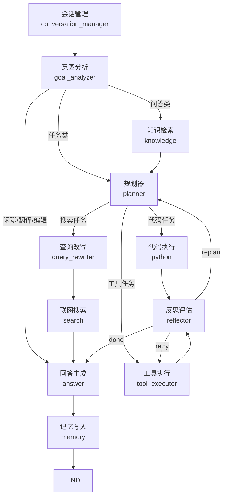

# 架构说明

> 面向研发与评审。部署与运维视角请看 [deployment.md](deployment.md) 与 [runbook.md](runbook.md)。

## 1. 系统概览

OmniForge 是一个**目标驱动的多 Agent 工作台**：用户给一句话目标，
系统识别意图 → 规划任务 → 调度工具 → 反思结果 → 生成回答，全程维护会话记忆。

```
前端 (Vue 3 SPA)
    │  HTTP / SSE
    ▼
FastAPI 应用层  agentflow/api/*         (chat / knowledge / sessions / files / models / memory / executions / system)
    │
    ▼
LangGraph 工作流  agentflow/graph/workflow.py
    │
    ├── Agent 层  agentflow/agents/*     (意图分析 / 规划 / 检索 / 搜索 / 代码 / 反思 / 回答 / 记忆)
 ├── 工具层    agentflow/tools/*      (注册表 + 6 个工具，插件化)
    ├── 知识层    agentflow/knowledge/*  (解析 / 分块 / 嵌入 / 向量库 / 混合检索 / 评测)
    └── 服务层    agentflow/services/*   (LLM / 搜索 / 长期记忆 / 文件提议)
    │
    ▼
存储：SQLite(agentflow.db) · 本地 Qdrant(data/qdrant) · 嵌入缓存 · knowledge_files/ · outputs/
```

## 2. 请求生命周期

一次对话请求按下面的图流转（条件边决定跳过哪些节点）：



关键点：

- **成功即跳过反思**：常规成功的任务继续执行下一个，不额外调用 LLM；仅在失败、队列空、或周期检查点时反思。
- **终止有上限**：规划/重规划/卡死轮次都有上限（见 `agentflow/config/termination.py`），超限强制收尾。
- **降级可见**：任节点失败会写入统一错误通道，回答中会体现"受限模式"。

## 3. 模块职责

| 模块 | 路径 | 职责 |
|---|---|---|
| Agent 协议 | `agents/base.py` | `run(state) -> state` 契约，所有 Agent 的结构化接口 |
| 意图分析 | `agents/goal_analyzer/` | 嵌入多锚点快路径 + LLM 兜底；输出 goal_type / knowledge_source / expected_outputs |
| 规划器 | `agents/planner/` | 任务队列生成（蓝图→模板→函数调用→JSON）、代码内容生成、任务合并 |
| 反思器 | `agents/reflection/` | 规则优先 + LLM 兜底评估；决定 done / next / retry / replan |
| 知识检索 | `agents/knowledge/` | 只提供参考资料，不生成答案 |
| 搜索 | `agents/search/` | 查询改写 + 联网搜索（DuckDuckGo / Tavily） |
| 代码执行 | `agents/python/` | 沙箱化 subprocess 执行 |
| 回答 | `agents/answer/` | 汇总上下文生成回答；项目类走完成摘要 |
| 记忆 | `agents/memory/` | 对话历史、滚动摘要、跨会话事实提取 |
| 工具系统 | `tools/` | `BaseTool` + 注册表（自动发现、动态 schema、动态路由） |
| 执行器 | `graph/executor.py` | 任务生命周期与分发；并行批次 |
| 工作流 | `graph/workflow.py` | LangGraph 节点/边/路由、终止策略、节点级追踪 |
| 会话 | `conversation/` | 槽位填充、指代消解、续问改写、分层记忆压缩 |
| 知识库 | `knowledge/` | 解析、分块、嵌入、索引、混合检索、离线评测 |
| 服务 | `services/` | LLM（熔断/重试/预算）、搜索、长期记忆、文件提议 |
| 接口层 | `api/` | 按领域的路由集合；共享存储访问与工作区路径助手 |
| 评测 | `eval/` | 意图/规划/工具/完成度评测 + 运行时反馈采集 |

## 4. 数据与存储

| 数据 | 位置 | 说明 |
|---|---|---|
| 会话 / 消息 / 文档元数据 / 模型配置 / 长期记忆 / 执行记录 | `agentflow/database/agentflow.db` | SQLite，WAL 模式，内建 schema 版本迁移 |
| 词法索引 | 同库 FTS5 表 | 中文分词（jieba）后建索引 |
| 向量索引 | `data/qdrant/` | Qdrant 本地磁盘模式；配置 `QDRANT_URL` 可切远程 |
| 嵌入缓存 | `data/embedding_cache.db` | 减少重复嵌入调用 |
| 知识库原文 | `knowledge_files/` | 上传后归档，供预览/重建 |
| 生成产物 | `outputs/` | 文件系统工具的输出目录 |
| 运行时反馈 | `data/feedback/feedback.jsonl` | 失败与项目完成样本，供评测回流 |
| 日志 | `logs/` | JSON + trace_id，按天轮转 |

> 容器化部署时上述目录必须挂持久卷，否则重建容器即丢数据（见 [deployment.md](deployment.md)）。
>
> 数据库、生成产物、知识库原文与日志的位置可用 `DATABASE_PATH` / `OUTPUTS_DIR` /
> `KNOWLEDGE_FILES_DIR` / `LOGS_DIR` 覆盖（测试套件也用它做隔离），默认仍在项目根目录下。

## 5. 关键机制

| 机制 | 位置 | 说明 |
|---|---|---|
| 终止策略 | `config/termination.py` | 规划/重规划/卡死上限，全部可配置，含单测 |
| 降级模式 | 各 Agent + `workflow.py` | LLM 不可用时走规则兜底，回答标注受限 |
| 熔断与重试 | `services/llm_service.py` | 按节点隔离的熔断器 + 指数退避；token 预算 |
| 工具参数修复 | `graph/workflow.py` | 工具调用失败后用一次 LLM 修复参数再执行（单任务与并行路径一致） |
| 并行执行 | `graph/executor.py` + `workflow.py` | 同优先级写文件 + 读操作/搜索并行，保证顺序安全 |
| 安全边界 | `tools/filesystem_tool.py`、`tools/python_tool.py` | 工作区包含校验、路径穿越/NUL/ADS 拦截、AST + 运行时沙箱 |
| 可观测 | `utils/logging.py`、`utils/metrics.py` | JSON 日志、trace_id、`/health`、`/metrics` |

## 6. 评测与反馈闭环

- 五套评测：意图识别、规划器、工具调用、完成度、RAG 检索（recall@k / NDCG / MRR 等）。
- 运行时反馈：每次对话按结果落盘（失败必录、项目/编码成功也录），可导出为失败案例集并回流评测集。

## 7. 扩展点

| 想做的事 | 怎么做 |
|---|---|
| 新增工具 | 继承 `BaseTool`，实现 `actions()` 与 `execute()`；放在 `tools/` 即被自动发现 |
| 新增 Agent | 实现 `AgentProtocol.run(state)`，在 `workflow.py` 注册节点与路由 |
| 调整循环上限 | 配置 `MAX_PLANNER_CYCLES` / `MAX_REPLAN_COUNT` / `MAX_STUCK_ROUNDS` / `REFLECTOR_PLANNER_CYCLE_CAP` |
| 换向量库/模型 | 配置 `QDRANT_URL`、`EMBEDDING_MODEL_NAME`、`MODEL_NAME`、`CODEGEN_MODEL` |
| 新增项目脚手架 | 在 `blueprints/*.yaml` 增加蓝图（关键词匹配 + 模板变量） |
| 记录架构决策 | 在 `docs/decisions/` 增加 ADR |
